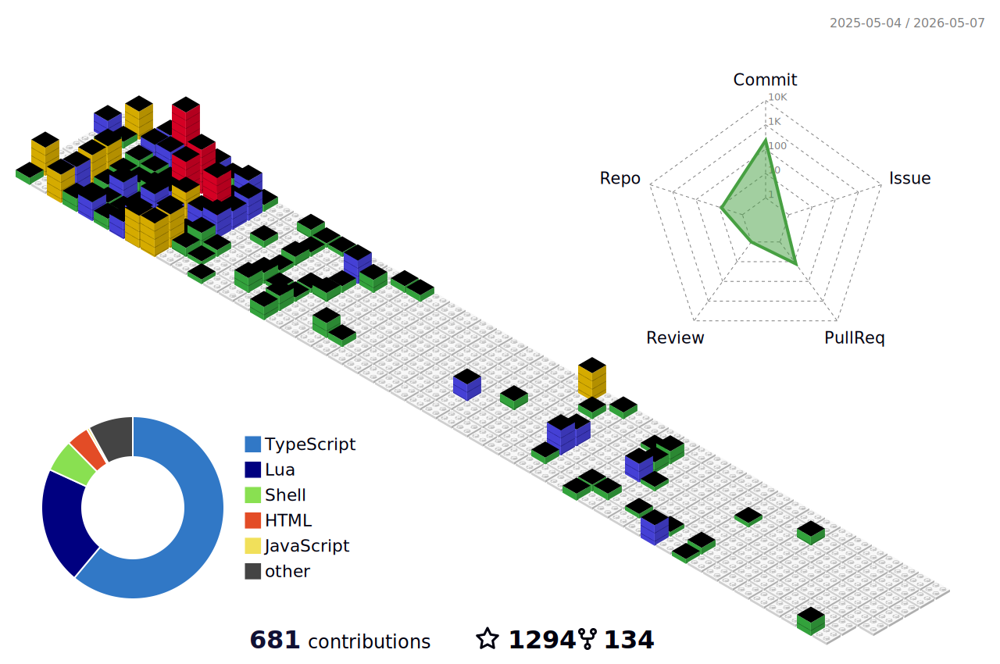

### Hi I'm Rootiest 👋

I'm a software developer and maker.

I'm currently spending most of my time working on [Klipper](https://klipper3d.org) and [Voron](https://vorondesign.com) related projects.

Reach me at:

Rootiest#5668 on Discord (Voron and Klipper servers)

Donate to support my work:

Or [Join the Rootiest Discord server](https://discord.gg/AYjVSvrVF2) for support and community interaction for my projects.

<picture>
  <source media="(prefers-color-scheme: dark)" srcset="resources/github-snake-dark.svg">
  <source media="(prefers-color-scheme: light)" srcset="resources/github-snake.svg">
  
</picture>

<picture>
  <source media="(prefers-color-scheme: dark)" srcset="profile-3d-contrib/profile-night-rainbow.svg">
  <source media="(prefers-color-scheme: light)" srcset="profile-3d-contrib/profile-gitblock.svg">
  
</picture>

<!--
**rootiest/rootiest** is a ✨ _special_ ✨ repository because its `README.md` (this file) appears on your GitHub profile.

Here are some ideas to get you started:

- 🔭 I’m currently working on ...
- 🌱 I’m currently learning ...
- 👯 I’m looking to collaborate on ...
- 🤔 I’m looking for help with ...
- 💬 Ask me about ...
- 📫 How to reach me: ...
- 😄 Pronouns: ...
- ⚡ Fun fact: ...
-->
